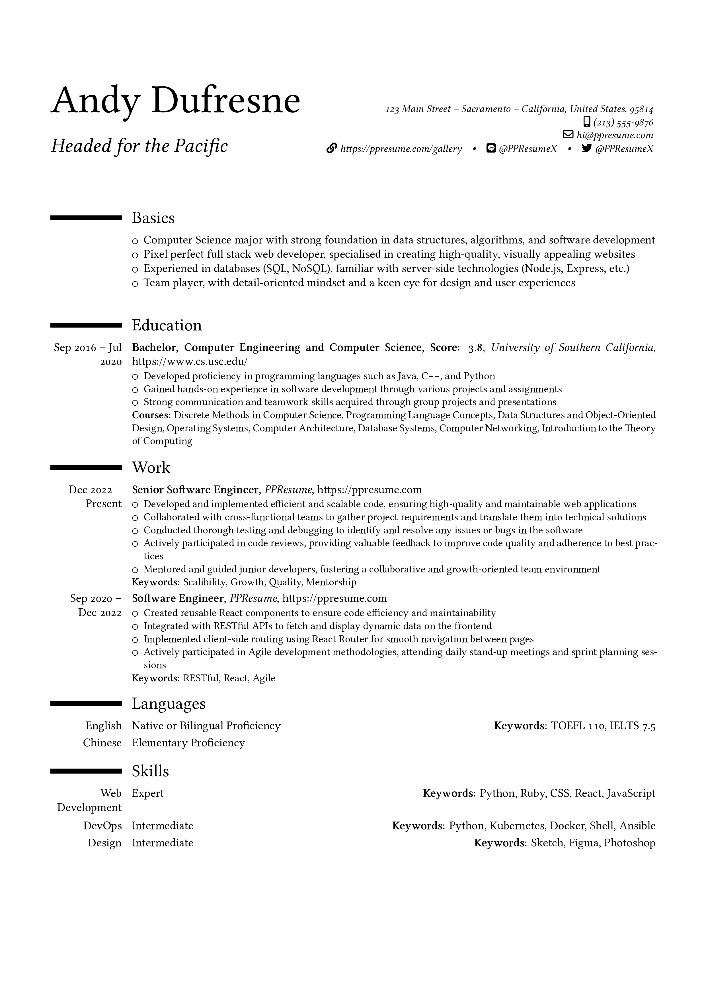

## Implementation

Moderncv classic is a modern and classic resume template based on
[xdanaux/moderncv](https://github.com/xdanaux/moderncv).

Under the hood, we use the following code for the LaTeX preamble:

```latex lineNumbers
\documentclass[a4paper, serif, 11pt]{moderncv}

%% moderncv
% style and color
\moderncvstyle{classic}
\moderncvcolor{black}

% needed by moderncv for showing icons
\usepackage{fontawesome5}
```

## Preview



Download the [YAML code from
Github](https://github.com/yamlresume/web/tree/main/content/docs/layout/templates/static/resources/moderncv-classic-template.yml).
